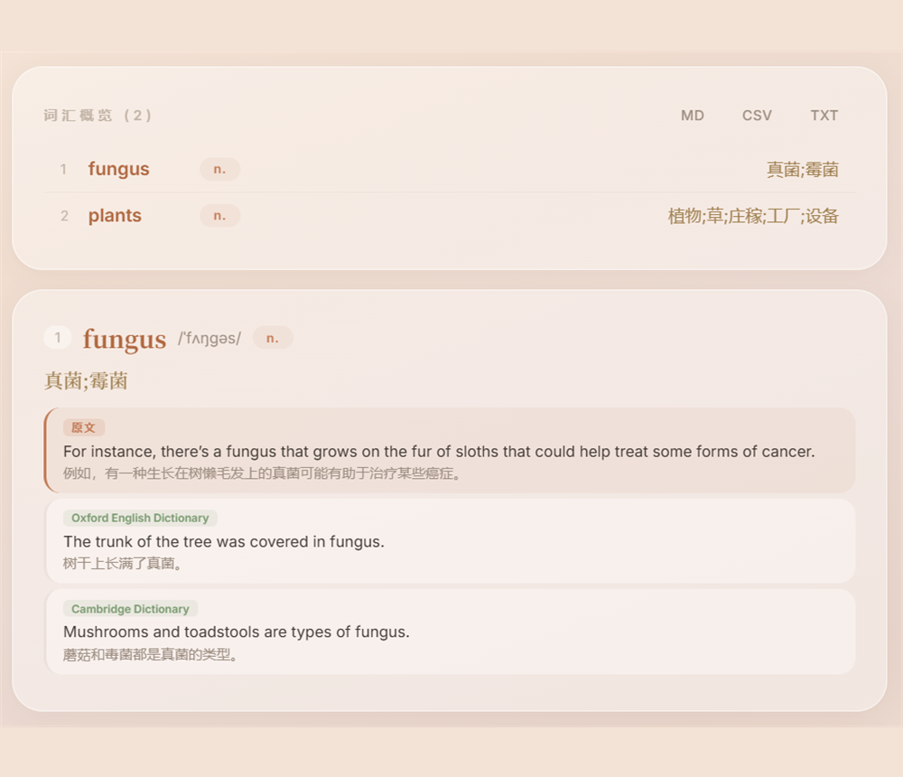
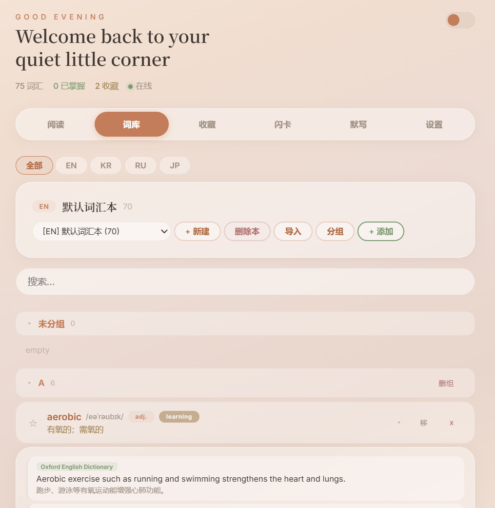

<div align="center">

# Lingua Muse 🪶

**A warm, glassmorphic desktop atelier for vocabulary memory across 7 languages.**

Read · Look up · Collect · Review — all in one calm, offline-first workspace.

</div>

---

## What is it

Lingua Muse turns any foreign-language text into a personal, structured vocabulary
notebook. Paste an article, click any word, and get a clean dictionary entry —
**part of speech · Chinese meaning · the in-context sentence with translation · two
example sentences from authoritative dictionaries** (Oxford / Cambridge / 広辞苑 /
표준국어대사전 …). Every word you look up flows automatically into your notebook,
ready for flashcards and dictation.

Built with Electron. **Your data stays 100% local** — a single JSON file on disk,
no account, no telemetry.

## 📸 Screenshots

<div align="center">

| Read & look up | Vocabulary book |
|:---:|:---:|
|  |  |

</div>

> Drop your own PNGs into the `screenshots/` folder as `read.png` and `vocab.png`
> (or update the paths above).

## ✨ Features

- **Read & Translate** — paste text or import `TXT / MD / CSV / DOCX / PDF`,
  translate the whole passage, then click any word for an instant lookup.
- **One consistent format** — every entry is normalized to
  `word · part of speech · Chinese meaning · original example + translation ·
  two authoritative-source examples + translations`. A dedicated cleaning layer
  strips stray markdown and fills missing fields, so the format never drifts.
- **Vocabulary Books** — multiple books, one language each, automatic A–Z
  grouping, search, and **batch auto-complete** (concurrent, with a self-healing
  per-word fallback).
- **Favorites · Flashcards · Dictation** — spaced-repetition review,
  known/unknown tracking, auto-star on repeated mistakes, and spell-from-meaning
  practice.
- **7 languages** — English · 日本語 · 한국어 · Français · Deutsch · Español · Русский.
- **Reliable persistence** — books, history, lookup cache and settings are saved
  to a JSON file (with an automatic backup) and survive every restart.
- **Crafted UI** — warm peach/cream glassmorphism, light/dark mode, custom wallpaper.

## 🚀 Getting started

### Use the app (no install)
1. Download `LinguaMuse.exe` (portable).
2. Double-click to run. On the first launch Windows SmartScreen may warn that the
   app is unsigned → **More info → Run anyway**.
3. Open **Settings**, enter any OpenAI-compatible API (endpoint / key / model —
   DeepSeek, GPT, etc.) and click **Test Connection**.
4. Paste some text and start reading. Looked-up words are saved automatically.

> The app stores data in `D:\WordMaster_Data` when a D: drive exists, otherwise in
> your user app-data folder — so it works on any Windows machine.

### Build from source
```bash
npm install
npm start          # run in dev
npm run build      # produce a portable Windows .exe in dist/
```

## 🛠️ Tech

Electron · single-file vanilla-JS renderer · file-backed local store ·
OpenAI-compatible chat API · a robust JSON/markdown normalization layer that
guarantees one consistent entry format.

## 🔐 Data & privacy

Fully local. No analytics. Lookups are sent **only** to the API endpoint you
configure. Export or import your entire library as JSON anytime from **Settings**.

## 📄 License

MIT
